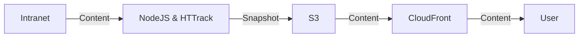
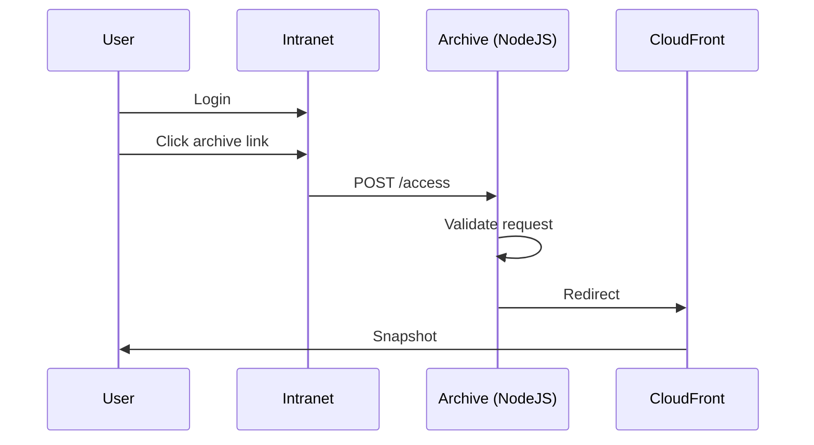

<div align="center">
 
# <br>Intranet Archive

[![repo standards badge](https://img.shields.io/endpoint?labelColor=231f20&color=005ea5&style=for-the-badge&url=https%3A%2F%2Foperations-engineering-reports.cloud-platform.service.justice.gov.uk%2Fapi%2Fv1%2Fcompliant_public_repositories%2Fendpoint%2Fintranet-archive&logo=data:image/png;base64,iVBORw0KGgoAAAANSUhEUgAAACgAAAAoCAYAAACM/rhtAAAABmJLR0QA/wD/AP+gvaeTAAAHJElEQVRYhe2YeYyW1RWHnzuMCzCIglBQlhSV2gICKlHiUhVBEAsxGqmVxCUUIV1i61YxadEoal1SWttUaKJNWrQUsRRc6tLGNlCXWGyoUkCJ4uCCSCOiwlTm6R/nfPjyMeDY8lfjSSZz3/fee87vnnPu75z3g8/kM2mfqMPVH6mf35t6G/ZgcJ/836Gdug4FjgO67UFn70+FDmjcw9xZaiegWX29lLLmE3QV4Glg8x7WbFfHlFIebS/ANj2oDgX+CXwA9AMubmPNvuqX1SnqKGAT0BFoVE9UL1RH7nSCUjYAL6rntBdg2Q3AgcAo4HDgXeBAoC+wrZQyWS3AWcDSUsomtSswEtgXaAGWlVI2q32BI0spj9XpPww4EVic88vaC7iq5Hz1BvVf6v3qe+rb6ji1p3pWrmtQG9VD1Jn5br+Knmm70T9MfUh9JaPQZu7uLsR9gEsJb3QF9gOagO7AuUTom1LpCcAkoCcwQj0VmJregzaipA4GphNe7w/MBearB7QLYCmlGdiWSm4CfplTHwBDgPHAFmB+Ah8N9AE6EGkxHLhaHU2kRhXc+cByYCqROs05NQq4oR7Lnm5xE9AL+GYC2gZ0Jmjk8VLKO+pE4HvAyYRnOwOH5N7NhMd/WKf3beApYBWwAdgHuCLn+tatbRtgJv1awhtd838LEeq30/A7wN+AwcBt+bwpD9AdOAkYVkpZXtVdSnlc7QI8BlwOXFmZ3oXkdxfidwmPrQXeA+4GuuT08QSdALxC3OYNhBe/TtzON4EziZBXD36o+q082BxgQuqvyYL6wtBY2TyEyJ2DgAXAzcC1+Xxw3RlGqiuJ6vE6QS9VGZ/7H02DDwAvELTyMDAxbfQBvggMAAYR9LR9J2cluH7AmnzuBowFFhLJ/wi7yiJgGXBLPq8A7idy9kPgvAQPcC9wERHSVcDtCfYj4E7gr8BRqWMjcXmeB+4tpbyG2kG9Sl2tPqF2Uick8B+7szyfvDhR3Z7vvq/2yqpynnqNeoY6v7LvevUU9QN1fZ3OTeppWZmeyzRoVu+rhbaHOledmoQ7LRd3SzBVeUo9Wf1DPs9X90/jX8m/e9Rn1Mnqi7nuXXW5+rK6oU7n64mjszovxyvVh9WeDcTVnl5KmQNcCMwvpbQA1xE8VZXhwDXAz4FWIkfnAlcBAwl6+SjD2wTcmPtagZnAEuA3dTp7qyNKKe8DW9UeBCeuBsbsWKVOUPvn+MRKCLeq16lXqLPVFvXb6r25dlaGdUx6cITaJ8fnpo5WI4Wuzcjcqn5Y8eI/1F+n3XvUA1N3v4ZamIEtpZRX1Y6Z/DUK2g84GrgHuDqTehpBCYend94jbnJ34DDgNGArQT9bict3Y3p1ZCnlSoLQb0sbgwjCXpY2blc7llLW1UAMI3o5CD4bmuOlwHaC6xakgZ4Z+ibgSxnOgcAI4uavI27jEII7909dL5VSrimlPKgeQ6TJCZVQjwaOLaW8BfyWbPEa1SaiTH1VfSENd85NDxHt1plA71LKRvX4BDaAKFlTgLeALtliDUqPrSV6SQCBlypgFlbmIIrCDcAl6nPAawmYhlLKFuB6IrkXAadUNj6TXlhDcCNEB/Jn4FcE0f4UWEl0NyWNvZxGTs89z6ZnatIIrCdqcCtRJmcCPwCeSN3N1Iu6T4VaFhm9n+riypouBnepLsk9p6p35fzwvDSX5eVQvaDOzjnqzTl+1KC53+XzLINHd65O6lD1DnWbepPBhQ3q2jQyW+2oDkkAtdt5udpb7W+Q/OFGA7ol1zxu1tc8zNHqXercfDfQIOZm9fR815Cpt5PnVqsr1F51wI9QnzU63xZ1o/rdPPmt6enV6sXqHPVqdXOCe1rtrg5W7zNI+m712Ir+cer4POiqfHeJSVe1Raemwnm7xD3mD1E/Z3wIjcsTdlZnqO8bFeNB9c30zgVG2euYa69QJ+9G90lG+99bfdIoo5PU4w362xHePxl1slMab6tV72KUxDvzlAMT8G0ZohXq39VX1bNzzxij9K1Qb9lhdGe931B/kR6/zCwY9YvuytCsMlj+gbr5SemhqkyuzE8xau4MP865JvWNuj0b1YuqDkgvH2GkURfakly01Cg7Cw0+qyXxkjojq9Lw+vT2AUY+DlF/otYq1Ixc35re2V7R8aTRg2KUv7+ou3x/14PsUBn3NG51S0XpG0Z9PcOPKWSS0SKNUo9Rv2Mmt/G5WpPF6pHGra7Jv410OVsdaz217AbkAPX3ubkm240belCuudT4Rp5p/DyC2lf9mfq1iq5eFe8/lu+K0YrVp0uret4nAkwlB6vzjI/1PxrlrTp/oNHbzTJI92T1qAT+BfW49MhMg6JUp7ehY5a6Tl2jjmVvitF9fxo5Yq8CaAfAkzLMnySt6uz/1k6bPx59CpCNxGfoSKA30IPoH7cQXdArwCOllFX/i53P5P9a/gNkKpsCMFRuFAAAAABJRU5ErkJggg==)](https://operations-engineering-reports.cloud-platform.service.justice.gov.uk/public-github-repositories.html#intranet-archive)
[](https://github.com/ministryofjustice/intranet/blob/main/LICENSE)

</div>

<br>
<br>

## Workflow

Archiving the Intranet, thankfully, is a task made simple using the following technologies:

1. Cloud Platform
2. AWS S3
3. AWS CloudFront
4. HTTrack Cli
5. NodeJS Server

## Infrastructure overview

This diagram shows the flow of data from the intranet to the user. 



> [!NOTE]  
> The first part, where the content is moved from the Intranet to the S3 bucket, is handled by the Archiver, and this is a scheduled task.  
> The second part where the user accesses a snapshot from S3, is handled by the CloudFront distribution.


## Viewing the latest snapshot

Access is granted to the snapshot if, you:

1) Have access to the [MoJ Intranet](intranet.gov.uk), and
2) Your [MoJ Intranet](intranet.gov.uk) account meets the necessary permissions, as defined in that codebase.

Access points:

1) [All agencies](https://intranet.justice.gov.uk/wp/wp-admin/)

Please get in touch with the [Intranet team on Slack](https://mojdt.slack.com/archives/C03QE40GVA6) for further 
information.

### Technical details of the accessing flow

1. A user logs into the Intranet.
2. The user clicks a link to the archive.
3. This submits a POST request to the archive NodeJS server.
   The payload contains an expiry and the users agency.
   The request is signed with a shared secret, and the server validates the signature.
4. The NodeJS responds by redirecting to the CloudFront distribution.
   The redirect URL contains cookies, so that the user can access the snapshot.



## Scheduling a snapshot

Find the config file at `deploy/<namespace>/config.yml`.

Update the `SNAPSHOT_SCHEDULE` environment variable with values for the desired agency.

It should be in the following pattern `<namespace>::<agency>::<day-of-week>::<hh:mm>(::<optional-depth>)`.

And, multiple values should be comma separated.

e.g. `dev::hq::Mon::17:30,dev::hmcts::Thu::17:30::3`

## Manually creating a snapshot

Snapshot scheduling should cover the project's use-case; manually creating a snapshot is limited to developers for debugging.

As such, it's required to `port-forward` to the running service, and make a POST request to the `/spider` endpoint.

```bash
# example POST request
curl -X POST http://localhost:2000/spider -d "agency=hq&env=dev&depth=2"
```

See the Cloud Platform and Commands sections below.

## Local development

Requires

- Docker

Optional

- Local instance of the Intranet

### Local Intranet

For reference, the code related to this project in the [intranet repository](https://github.com/ministryofjustice/intranet/) is at:

- [app/themes/clarity/inc/agency.php](https://github.com/ministryofjustice/intranet/blob/main/public/app/themes/clarity/inc/agency.php)
- [app/themes/clarity/inc/admin/intranet-archive-link.php](https://github.com/ministryofjustice/intranet/blob/main/public/app/themes/clarity/inc/admin/intranet-archive-link.php)

If you want to test scraping of the intranet from a local source then the intranet must be running locally at [http://intranet.docker].

For the archive link on the intranet dashboard to work correctly:

- At least one agency should have `'has_archive' => true` set in `agency.php -> getList()`.
- The environment variables: `INTRANET_ARCHIVE_URL` and `INTRANET_ARCHIVE_SHARED_SECRET` must be set. See [Configuration section](#configuration).

### Installation

Clone to your machine:

```bash
git clone https://github.com/ministryofjustice/intranet-archive.git && cd intranet-archive
```

Prepare the environment:

```bash
make env
```

This command, will create a `.env` file in the root of the project. 

Open the .env file and set the variables, annotated with the numbers 1 - 7.

Start docker compose:

```bash
make run
```

There is a script designed to help you install the [Dory Proxy](https://github.com/FreedomBen/dory), if you'd like to.

If you chose to install Dory, you can access the application here:

[app.archive.intranet.docker](http://app.archive.intranet.docker/)

Otherwise, access the application here:

[localhost:2000](http://localhost:2000/)

## Application routes

Locally, request can be made to these routes as part of familiarisation with the application.

Ensure that previous steps have been followed:

- populate the .env file of this project
- populate the .env file of the intranet project
- both projects are running and the intranet is accessible at [http://intranet.docker]

### `/status`

There is a private `/status` route that will return a JSON response with the applications status, 
including if it has access to the S3 bucket and intranet URLs.

```bash
# Make a GET request with curl to the /status route
curl http://app.archive.intranet.docker/status
curl http://localhost:2000/status
```

The response should include `{"fetchStatuses":[{"env":"local","status":200}],"s3Status":true}`

### `/metrics`

There is a `/metrics` route for exporting metrics in OpenMetrics format.

The response include various metrics to indicate that the application is working as expected.

e.g. do we have access to the S3 bucket for storage, do we have access to the intranet?

An exhaustive list, with help text, can be found in [constants.js](./conf/node/constants.js).

```bash
# Make a GET request with curl to the /metrics route
curl http://localhost:2000/metrics
```

The response should look like the following example:

```
# HELP bucket_access Can the service access the S3 bucket
# TYPE bucket_access gauge
bucket_access 1
...
```

### `/spider`

This is a private route that will trigger a snapshot, it should only be used for debugging purposes.

```bash
# Make a POST request with curl to the /spider route
curl -X POST http://app.archive.intranet.docker/spider -d "agency=hmcts&env=local&depth=2"
```

The response should be `{"status":200}` and the container logs should show the snapshot being created.

> [!NOTE]
> The progress logs can be found in the terminal where the application is running.
> The updates interval is every second for the first second, then every 5 minutes after that.

A scrape depth of 2 is sufficient to validate that HTTrack is working correctly. It will take approx. 1 minute to complete.

For a more thorough scrape, set the depth to 3, that will take approx. 20 minutes.

For a full scrape, remove the optional depth parameter, that will take approx. 12 hours.

### `/access`

The primary route is `/access`, this is the only public route and it redirects to the CloudFront distribution. 
For this to work, you should be running the intranet project locally, on the Intranet Dashboard click on the link to the archive.
Your browser will be sent to `http://app.archive.intranet.docker/access` and you will be redirected to a URL like `http://archive.intranet.docker/local-hmcts/index.html`.

### Additional local endpoints

It may help with local debugging to browse the S3 bucket. Minio is used as an alternative to AWS S3, and can be accessed at [http://minio.archive.intranet.docker] or [http://localhost:9010]. 

Refer to `AWS_ACCESS_KEY_ID` & `AWS_SECRET_ACCESS_KEY` in the `.env` file - these are the web interface credentials.

## Understanding application logic

Let's begin with the main controller...

The main controller, [main.js](./conf/node/controllers/main.js), is a script that runs all necessary functions in order to create a snapshot and then upload it to S3.

The entrypoint script is [server.js](./conf/node/server.js). This script is responsible for setting up the server and scheduling the main controller to run at specific times.

As we are running an Express server, we use middleware, located at [middleware.js](./conf/node/middleware.js), in order to parse and validate incoming requests.

Along side the main controller are various distinct controllers. These controllers are each concerned with one distinct aspect of the snapshot process. 
For example, the [cloudfront.js](./conf/node/controllers/cloudfront.js) controller is responsible for various functions related to the CloudFront distribution, including creating signed cookies.

## Tests and TDD

In an aim to make the application robust and easy to maintain, we have implemented tests using Jest.

Middleware, and the controllers have tests, the tests are adjacent to the files they are testing e.g. `middleware.test.js` will be found next to `middleware.js`.

When making a change to the application, you can run the tests with the following command:

```bash
# Exec into the container
make bash
# Run the tests
npm run test
# Or, run tests while watching for changes
npm run test:watch
# Or, append a particular test file
npm run test middleware
# Or, append a particular test file and watch for changes
npm run test:watch middleware
```

The main test requires access to dev and live intranet sites. If you see the following logs:

> Could not access production.  
  Add JWT to your .env file to access the intranet.

... and the main test is failing, you should add a JWT to the `.env` file.

Visit dev.intranet.justice.gov.uk, wait for one heartbeat request (30s), and copy the JWT from the browser's cookies.

> [!NOTE]  
> As dev.intranet.justice.gov.uk uses an Entra App that is on the development tenant, 
> you will need to use your `@devl.justice.gov.uk` email address to log in.

Save this to `INTRANET_JWT_DEV` in `.env`. 

Similarly, visit the production intranet and save the JWT to `INTRANET_JWT_PROD` in `.env`.

The main test should run successfully.

> [!NOTE]  
> These JWTs are short lived credentials and will expire after 60 minutes.
> It is therefore recommended to run the complete test suite `npm run test` immediately after obtaining the JWTs.

## HTTrack

At the very heart of the Archiver sits [HTTrack](https://en.wikipedia.org/wiki/HTTrack). This application is configured by Node to take a snapshot of the MoJ Intranet. 

Node's `spawn` and `exec` functions are used to run HTTrack in the background. The functions are located at [httrack.js](./conf/node/httrack.js), and the test suite is at [httrack.test.js](./conf/node/httrack.test.js).

Observe HTTrack with the following actions:

- HTTrack functions can be tested with the command `npm run test httrack`.
- It is also a dependency of `main`, that can be tested with the command `npm run test main`.
- And, it can be seen in action if the `/spider` route is requested.
   ```bash
   # Make a POST request with curl to the /spider route
   curl -X POST http://app.archive.intranet.docker/spider -d "agency=hmcts&env=local&depth=1"
   ```
- Use the `SNAPSHOT_SCHEDULE` environment variable to schedule a snapshot.

## Configuration

The following table lists the environment variables that can be set in the `.env` file.

When the application is deployed: 
- the secrets are stored in the [Github Actions secrets](https://github.com/ministryofjustice/intranet-archive/settings/secrets/actions).
- config values (that are not secret) are stored in each environment's [config.yml](./deploy/dev/config.yml) file.

| Variable                            | Description                                                         | Format/Example                |
| ------------------------------------| ------------------------------------------------------------------- | ----------------------------- |
| **Application Config**                                                                                                                    |
| `ALLOWED_AGENCIES`                  | A comma separated list of agencies that are allowed to be archived. | `hq,hmcts`                    |
| `SNAPSHOT_SCHEDULE`                 | A comma separated of formatted schedules for the snapshots.         | `dev::hq::Mon::17:30::3`      |
| **Intranet Secrets**                                                                                                                      |
| `INTRANET_JWT_DEV`                  | JWT for the dev intranet                                            | Header, payload and sig.      |
| `INTRANET_JWT_STAGING`              | JWT for the staging intranet                                        | 〃                            |
| `INTRANET_JWT_PRODUCTION`           | JWT for the production intranet                                     | 〃                            |
| `INTRANET_ARCHIVE_SHARED_SECRET`    | Shared secret for, for signing `/access` requests                   | 64 bit base64 string          |
| **WS Secrets (local only)**                                                                                                               |
| `AWS_ACCESS_KEY_ID`                 | AWS access key (for minio)                                          | `local-key-id`                |
| `AWS_SECRET_ACCESS_KEY`             | AWS secret access key (for minio)                                   | `local-access-key`            |
| **S3**                                                                                                                                    |
| `S3_BUCKET_NAME`                    | The S3 bucket on Cloud Platform this is an output of S3 module      | `local-bucket` `cloud-platf…` |
| **Cloudfront**                                                                                                                            |
| `AWS_CLOUDFRONT_PRIVATE_KEY`        | The private key for signing CloudFront cookies                      | RSA private key               |
| `AWS_CLOUDFRONT_PUBLIC_KEY`         | The public that CloudFront uses to verify the signed access policy  | RSA public key                |
| `AWS_CLOUDFRONT_PUBLIC_KEYS_OBJECT` | Active keys from the CF module (used to lookup ID from public key)  | [{"id":"*","comment":"hash"}] |

### JWTs for local development

Obtaining JWTs when working locally is a manual process. 

Visit dev.intranet.justice.gov.uk, wait for one heartbeat request (30s), and copy the JWT from the browser's cookies.

Save this to `INTRANET_JWT_DEV` in `.env`. 

Similarly, visit the production intranet and save the JWT to `INTRANET_JWT_PROD` in `.env`.

### JWTs for the Cloud Platform

To obtain JWTs that will be used by the application on Cloud Platform, you will need to run a command on an intranet FPM container.

There is a helper script for this in the [intranet-tools](https://github.com/ministryofjustice/intranet-tools) repository.

```bash
# Clone the intranet-tools repository
# Set NSP=intranet-dev, NSP=intranet-staging or NSP=intranet-production in .env
# Run this command from the project root
make gen-jwt role=intranet-archive
```

These JWTs should be stored in GitHub repository secrets.

Note: these JWTs are valid for 3 years, and are only valid for requests originating from Cloud Platform's egress.

### Shared secret

The shared secret is used to sign requests to the `/access` route. This is to ensure that only authorised requests are able to access the snapshots.

For local development:

- Run `make key-gen` from the intranet project.
- Copy `INTRANET_ARCHIVE_SHARED_SECRET` from the intranet project's `.env` file to the intranet-archive project's `.env` file.

For Cloud Platform:

- Run `key-gen-shared-secret` from the root of this project.
- Paste the output to the GitHub repository secrets for both the intranet and intranet-archive repositories.
- Repeat this step for each environment: so that dev keys are different to staging keys, and staging keys are different to production keys.

### CloudFront keys

In this project, CloudFront keys are used to sign cookies. The keys are always generated locally by running `make key-gen-` commands.

For local development:

A set of dummy keys, that are not actually valid for a CloudFront distribution, are required so that the application can run and be tested. 

These keys are generated by running the following command: `key-gen-private`. Follow the instructions in the terminal (marked as A) to generate the keys for your .env file.

For CI/CD:

Again,  set of dummy keys, that are not actually valid for a CloudFront distribution, are required so that the application can tested.

Run: `key-gen-private`. Follow the instructions in the terminal (marked as B) to generate the keys for the `TEST_AWS_CLOUDFRONT_*` GitHub repository secrets.

For Cloud Platform:

The keys are generated by running the following command: `key-gen-private`. Follow the instructions in the terminal (marked as C) to generate the keys for the `AWS_CLOUDFRONT_*` GitHub repository secrets.

## Debugging

The output of the controllers and HTTrack can be noted in Docker Composes' `stdout` in the running terminal window.

Fot HHTrack, a detailed and linear output stream is available in the `hts-log.txt` file. You can find this in the root of the snapshot. e.g. `/tmp/snapshots/hq/2021-09-01/hts-log.txt`.

## Custom HTTrack commands

During the build of the Archiver, we came across many challenges, two of which almost prevented our proof of concept 
from succeeding. The first was an inability to display images. The second was changing the Agency Switcher link destination.

**1) The HTTrack `srcset` problem**

In modern browsers, the `srcset` attribute is used to render a correctly sized image, for the device the image was loaded
in. This helps to manage bandwidth and save the user money. The trouble is HTTrack doesn't modify the URLs in `srcset` 
attributes so instead, we get no images where the attribute is used.

Using `srcset` in the Archive bears little value so to fix this we decided to remove `srcset` completely, we use
[HTTracks' `-V` option](https://manpages.debian.org/testing/httrack/httrack.1.en.html#V); this allows us to execute a command on every file that is downloaded. In particular, we run the 
following `sed` command, where `$0` is the file reference in HTTrack.

```bash
# find all occurrences of srcset in the file referenced by $0 
# select and remove, including contents.
 
sed -i 's/srcset="[^"]*"//g' $0
```

**2) The HTTrack `/agengy-switcher` problem**

We do not want the archiver to crawl the `/agency-switcher` page. This is because, the page is unnecessary in the context 
of browsing an agency's archived snapshot. 

We use a custom command to replace the agency switcher link on all pages, and replace it with a link to the root of the cdn domain.
This link to the root of the cdn domain will show the index page, and allow the user to navigate to the agency they want to view.

```bash
# find all occurrences of href="https://intranet.justice.gov.uk/agency-switcher/" in the file referenced by $0 
# and replace them with href="/".
 
sed -i 's|href="https://intranet.justice.gov.uk/agency-switcher/"|href="/"|g' $0
```

## Cloud Platform

In an aim to towards good security practices, when this application is deployed to the Cloud Platform, the `/access` is the only route that is open publicly.
The `/access` route allows users to be redirected to the CloudFront distribution, where they can access the snapshot.

Private routes, `/status` and `/spider` are used for developer purposes only. To access these endpoints, port-forward to the service. See the command below.

It is possible to 
[interact with running pods with help from this cheatsheet](https://kubernetes.io/docs/reference/kubectl/cheatsheet/#interacting-with-running-pods).
Please be aware that with every call to the Cloud Platform k8s cluster, you will need to provide the namespace, as shown below:

```bash
kubectl -n intranet-archive-dev
```

### Metrics 

The metrics endpoint exposes important information about the application. 

The metrics can be manually requested directly from the `/metrics` route by port forwarding and making a curl request. This may be useful for debugging.

```bash
kubectl -n intranet-archive-dev port-forward service/intranet-archive-service 2000:80
curl http://localhost:2000/metrics
```

We can verify that the Prometheus is scraping the metrics by visiting the Prometheus targets page.

e.g. for the dev environment:

https://prometheus.cloud-platform.service.justice.gov.uk/targets?search=&scrapePool=serviceMonitor%2Fintranet-archive-dev%2Fintranet-archive-metrics%2F0

### Grafana Dashboards

A Grafana dashboard has been configured to visualise the metrics data. The dashboards can be accessed at the following URL:

https://grafana.live.cloud-platform.service.justice.gov.uk/d/xywyqxz07sxkwg/cdpt-intranet-archive

## Commands

**Kubernetes**
```bash
# list available pods for the namespace
kubectl -n intranet-archive-dev get pods

# copy a log file from a pod to your local machine 
# update pod-id, agency and date
kubectl -n intranet-archive-dev cp intranet-archive-dev-<pod-id>:/archiver/snapshots/intranet.justice.gov.uk/<agency>/<date>/hts-log.txt ~/hts-log.txt

# port-forward to a running pod
kubectl -n intranet-archive-dev port-forward service/intranet-archive-service 2000:80
```

**Make**

| Command                      | Description                                                                                                                       |
| ---------------------------- | ----------------------------------------------------------------------------------------------------------------------------------|
| **Local Development**        |                                                                                                                                   |
| `make launch`                | Checks if the intranet docker instance is running; if not, launch dory and docker in the background                               |
| `make run`                   | Launch the application locally with `docker compose up`, requiring `env` + `dory`                                                 |
| `make down`                  | Alias of `docker compose down`.                                                                                                   |
| `make bash`                  | Open a bash shell on the spider container. The application must already be running (e.g. via `make run`) before this can be used. |
| **Verify prod. locally**     |                                                                                                                                   |
| `make build-prod`            | Build the production image (for verifying that the production image can be built locally).                                        |
| `make up-prod`               | Launch the production image locally (for verifying that the production image can be launched locally).                            |
| **Intranet Secrets**         |                                                                                                                                   |
| `make key-gen-shared-secret` | Generate a shared secret for the application, see [Shared Secret](#shared-secret).                                                |
| **CloudFront**               |                                                                                                                                   |
| `make key-gen-private`       | Generate a private key for CloudFront, see [CloudFront keys](#cloudfront-keys).                                                   |
| `make key-gen-public`        | Generate a public key for CloudFront, see [CloudFront keys](#cloudfront-keys).                                                    |
| `make key-gen-object`        | Generate an object for CloudFront, see [CloudFront keys](#cloudfront-keys).                                                       |
| `make key-gen-clean`         | Remove all generated keys.                                                                                                        |